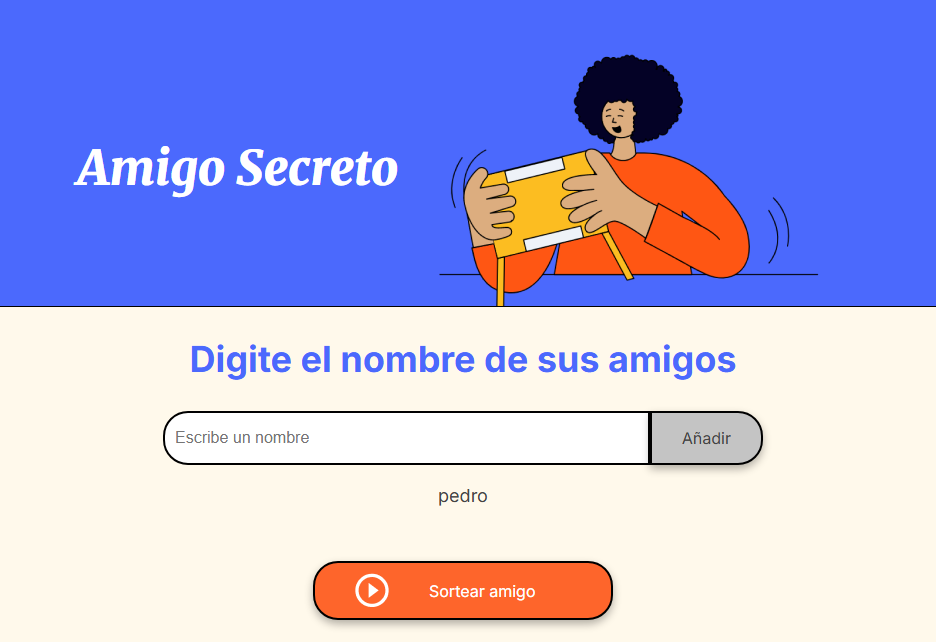

# Challenge-amigo-secreto-ALURA  

Challenge del curso Principiante en Programación G8 - ONE, Alura. El objetivo principal de este repositorio es desarrollar las habilidades de  lógica de programación.  Se ha desarrollado una aplicacion que permite ingresar nombres y realizar un sorteo aleatorio y determinar quién es el "amigo secreto".

## Índice
* [Índice](#índice)
* [Descripción del proyecto](#%EF%B8%8F-descripción)
* [Funcionalidades](#%EF%B8%8F-funcionalidades)
* [Agregar nombres](#agregar-nombres)
* [Validar entrada](#validar-entrada)
* [Visualizar la lista](#visualizar-la-lista)
* [Sorteo Aleatorio](#sorteo-aleatorio-botón-sortear-amigo)
* [Recursos](#recursos-utilizados)
* [Desarrollador](#-desarrollador)

#  Descripción
- Aplicación que permite ingresar nombres de amigos en una lista para luego realizar un sorteo aleatorio y determinar quién es el "amigo secreto".

- El usuario deberá agregar nombres mediante un campo de texto y un botón "Añadir". 

- Los nombres ingresados se mostrarán en una lista visible en la página.

- Al finalizar, un botón "Sortear Amigo" seleccionará uno de los nombres de forma aleatoria, mostrando el resultado en pantalla.

# Funcionalidades
## Agregar nombres
Los usuarios escribirán el nombre de un amigo en un campo de texto y lo agregarán a una lista visible al hacer clic en "Añadir".

 ()
 ()

## Validar entrada
Si el campo de texto está vacío, el programa mostrará una alerta pidiendo un nombre válido.

()

## Visualizar la lista
Los nombres ingresados aparecerán en una lista debajo del campo de entrada.

()

## Sorteo aleatorio (Botón 'Sortear amigo')
Al hacer clic en el botón "Sortear Amigo", se seleccionará aleatoriamente un nombre de la lista y se mostrará en la página.

()

## Recursos utilizados

  * [Curso Principiante en Programación G8 - ONE](https://app.aluracursos.com/formacion-programacion-primeros-pasos-grupo8-one)
  * HTML - CSS - JavaScript
#  Desarrollador
Santiago Zarlenga
(https://github.com/santyzar)
